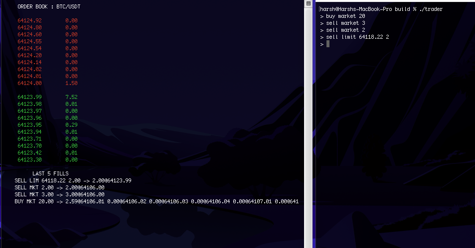

# ez-order-matcher
Primitive FIFO order matching engine in C++, using the [Binance API](https://developers.binance.com/docs/binance-spot-api-docs/rest-api/market-data-endpoints). 

This was mainly built as an exercise in :
1. Better understanding JSON response handling.
2. Practicing C++ concurrency (lock based : ```std::thread``` and ```std::mutex```) 
3. Implementing some sweet concepts I'm learning in the CFA curriculum.



### Components
```order_book.h```
* Defines order struct.
* Defines order_book struct, as containing 2 maps of price -> order list (asks and bids).
* Handles market / limit order execution.

```binance.h```
* Defines limit and depth structs.
* Retrieves JSON object from Binance API and populates depth object with level.

```display.h```
* Initializes and resets terminal screen.
* Draws order book (green bids red asks).

```ipc.h```
* Defines filesystem path of named pipe (FIFO) that viewer and trader processes use to communicate.

```trader.cpp```
* Opens FIFO pipe for writing.
* Switches FD back to blocking. 
* Accepts trade orders from stdin and writes to pipe.

```viewer.cpp```
* Fetches market data and calls ```display.h/draw(...)``` to draw the order book. 
* Matches orders (kinda counterintuitive but it was simplest to do it in viewer process).
* Prints last 5 fills to stdout. 

### Usage
```bash
mkdir build && cd build
cmake build . --target viewer --target trader
open -a Terminal . ## MacOS command
# on 1 window
./viewer
# on the other window
./trader
```

### Notes on dependencies
* **POSIX** : the FIFO ipc utilizes POSIX calls (```mkfifo```, ```open```, ```read```, ```write```, ```poll```, ```fcntl```, ```unlink```), so it won't work on Windows.
* **cpr 1.11.2** : the HTTP client used by ```binance.cpp```, which transitively pulls ```libcurl``` (what takes the first build a long time). 
* **nlohmann/json v3.11.3** : JSON parser for Binance API response. Check it out [here](https://github.com/nlohmann/json).
